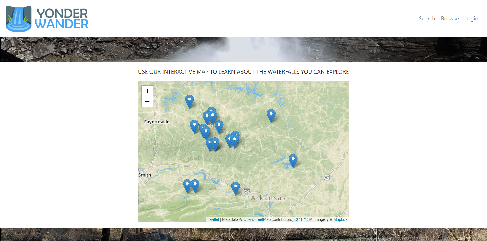
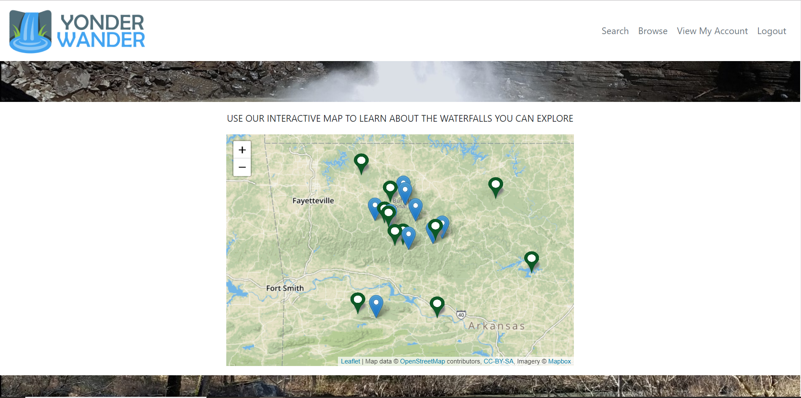
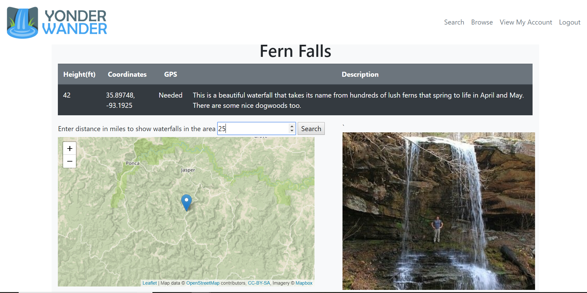
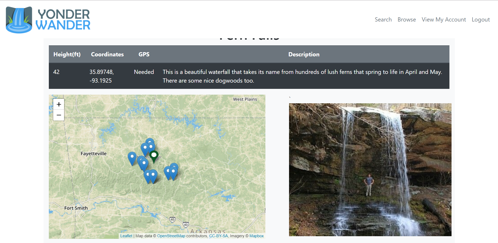
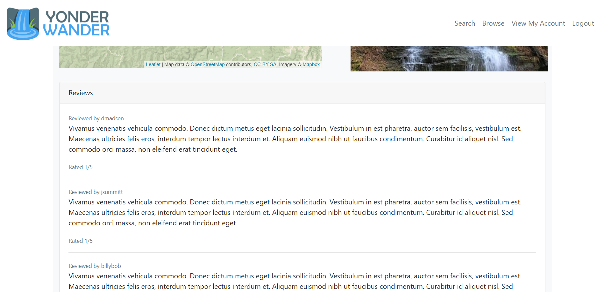
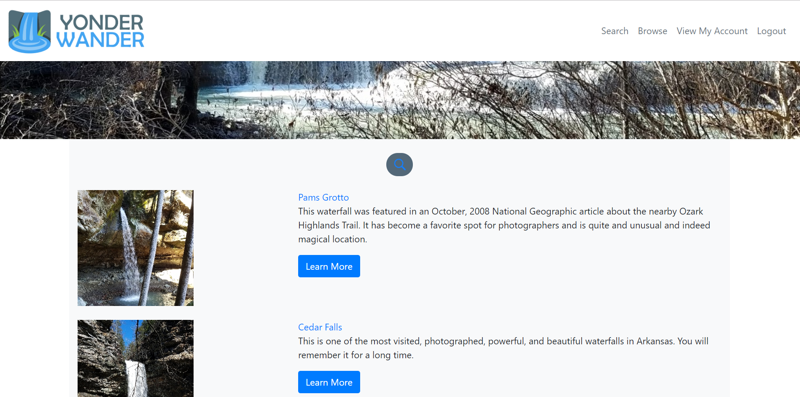
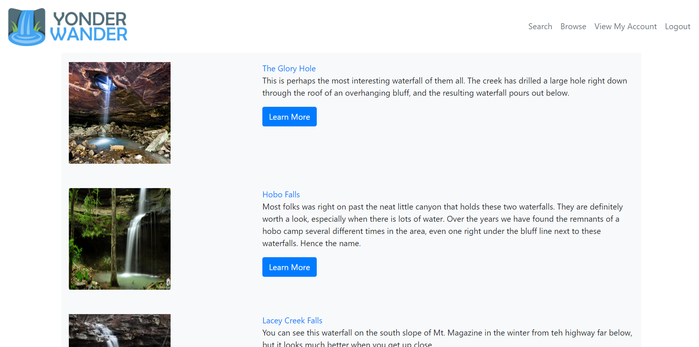

# Yonder Wander

Yonder Wander is an interactive guide to discovering the beautiful waterfalls of Arkansas

* View waterfalls on an interactive map
* Click on a map pin to view specific waterfall details
* Keep track of your completed waterfalls
* Search waterfalls by name or browse the complete list
* Find waterfalls close to each other for maximizing trips

Home Page - Welcome Banner

Home Page - Map showing all waterfalls

Home Page Post Login - Pins for user's completed waterfalls turn green

Login Page

Account Creation Page

Waterfall Detail Page - 25 Entered into search bar to show waterfalls within that range on post

Post Waterfall Detail Page - Shows all waterfalls with 25 miles of Fern Falls

Waterfall Detail Page Reviews

Waterfall Detail Page New Review

Search Waterfalls

Browse all Waterfalls

## Coming Soon
* More waterfalls
* More information for each individual waterfall
* Put quality gauge on waterfall details pages based on recent localized rain fall
* Add other points of interest such as parks and campgrounds

## Tech Stack
* Java
* HTML/CSS
* Javascript
* Bootstrap
* MySQL
* JSON
* Leaflet Map API

